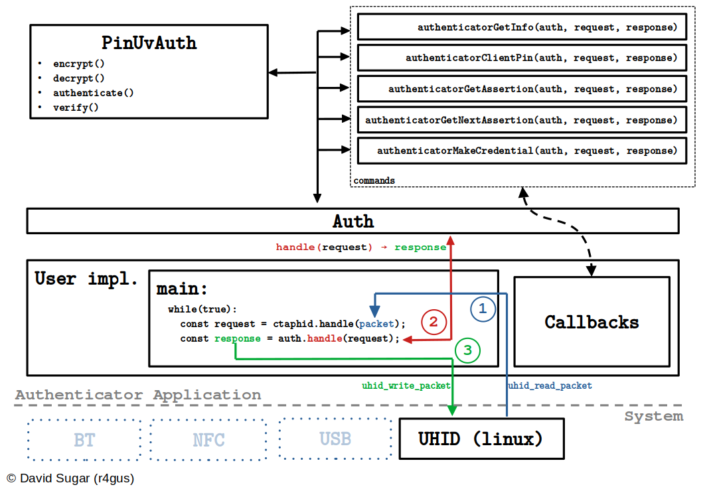

> We track the latest stable release of Zig (`0.11.0`)

FIDO2 compatible authenticator library written in [Zig](https://ziglang.org/).

Checkout: [KeyPassPro](https://github.com/r4gus/keypass)

## QA

<ins>What is FIDO2?</ins>

FIDO2 is a protocol designed for authentication purposes. It can be used as single factor (e.g., as a replacement for password based authentication) or as a second factor.

<ins>I've heard the term Passkey but what is that?</ins>

Passkey is a marketing term which is used to refer to a specific FIDO2 authenticator configuration. A authenticator can be configured to use so called discoverable credentials (also referred to as resident keys). Those credentials are stored somewhere on your device, e.g. in a encrypted database. Devices can also be protected by some form of user verification. This can be a PIN or a built in user verification method like a finger print scanner. Passkey refers to FIDO2 using discoverable credentials and some form of user verification. 

Please note that this is only one interpretation of what PassKey means as the term itself is nowhere defined.

<ins>How does it work?</ins>

FIDO2 uses asymmetric cryptography to ensure the authenticity of the user. A unique credential (key-pair) is created for each relying party (typically a web server) and bound to the relying party id (e.g., google.com). The private key stays on the authenticator and the public key is stored by the relying party. When a user wants to authenticate herself, the relying party sends a nonce (a random byte string meant to be only used once) and some other data, over the client (typically your web browser), to the authenticator. The authenticator looks up the required private key and signs the data with it. The generated signature can then be verified by the relying party using the corresponding public key.

<ins>What is the difference between FIDO2, PassKey and WebAuthn?</ins>

You might have noticed that FIDO2, PassKey and even WebAuthn are often used interchangeably by some articles and people which can be confusing, especially for people new to the protocol. Here is a short overview:

* `FIDO2` Protocol consisting of two sub-protocols: Client to Authenticator Protocol 2 (`CTAP2`) and Web Authentication (`WebAuthn`)
* `CTAP2` Specification that governs how a authenticator (e.g. YubiKey) should behave and how a authenticator and a client (e.g. web-browser) can communicate with each other.
* `WebAuthn` Specification that defines how web applications can use a authenticator for authentication. This includes the declaration of data structures and Java Script APIs.
* `PassKey`: A authenticator with a specific configuration (see above).

<ins>Why should I use FIDO2?</ins>

FIDO2 has a lot of advantages compared to passwords:

1. No secret information is shared, i.e. the private key stays on the authenticator or is protected, e.g. using key wrapping.
2. Each credential is bound to a relying party id (e.g. google.com), which makes social engineering attacks, like phishing websites, quite difficult (maybe impossible).
3. Users don't have to be concerned with problems like password complexity.
4. If well implemented, FIDO2 provides a better user experience (e.g., faster logins).
5. A recent paper showed that with some adoptions, FIDO2 is ready for a post quantum world under certain conditions ([FIDO2, CTAP 2.1, and WebAuthn 2: Provable Security and Post-Quantum Instantiation, Cryptology ePrint Archive, Paper 2022/1029](https://eprint.iacr.org/2022/1029.pdf)).

<ins>Why shouldn't I use FIDO2?</ins>

1. The two FIDO2 subprotocols (CTAP2 and WebAuthn) are way more difficult to implement, compared to password authentication.
2. There are more points of failure because you have three parties that are involved in the authentication process (authenticator, client, relying party).
3. Currently not all browsers support the CTAP2 protocol well (especially on Linux).
4. You don't want to spend money on an authenticator (you usually can't upgrade) and/or you don't trust platform authenticators.

<ins>Does this library work with all browsers?</ins>

Answering this question isn't straightforward. The library, by its nature, is designed to be independent of any particular platform, meaning that you have the responsibility of supplying it with data for processing. To put it differently, you're in charge of creating a functional interface for communicating with a client, typically a web browser. On Linux, we offer a wrapper for the uhid interface, simplifying the process of presenting an application as a USB HID device with a Usage Page of F1D0 on the bus. Regrettably, it appears that not all web browsers are capable of discovering uhid devices.

| Browser | supported? |
|:-------:|:----------:|
| Chrome  |    yes     |
| Brave   |    yes     |
| Chromium | no |
| Firefox  | no |

<ins>Does this library implement the whole CTAP2 sepc?</ins>

No, we do not fully implement the entire [CTAP2](https://fidoalliance.org/specs/fido-v2.2-rd-20230321/fido-client-to-authenticator-protocol-v2.2-rd-20230321.html#intro) specification. In the initial version of this library, which can be found on GitHub, our aim was to remain completely platform-agnostic and cover most of the CTAP2 specification. However, this approach introduced complexities for both users and developers. The current version of this library strikes a balance between usability and feature completeness.

We offer support for operations like __authenticatorMakeCredential__, __authenticatorGetAssertion__, __authenticatorGetInfo__, and __authenticatorClientPin__, with built-in support for __user verification__ and the __pinUvAuth protocol__ (versions 1 and 2). You are responsible for handling data management tasks (such as secure storage, updates, and deletions), verifying user presence, and conducting user verification. These responsibilities are fulfilled by implementing the necessary callbacks used to instantiate an authenticator (refer to the "Getting Started" section for details).

## Design

## Gettings Started

Read the [getting started guide](https://codeberg.org/r4gus/keylib/wiki/Getting-Started) in the Wiki.

## Resources

- [CTAP2](https://fidoalliance.org/specs/fido-v2.1-ps-20210615/fido-client-to-authenticator-protocol-v2.1-ps-errata-20220621.html#intro) - FIDO Alliance
- [WebAuthn](https://www.w3.org/TR/webauthn-3/) - W3C
- [CBOR RFC8949](https://www.rfc-editor.org/rfc/rfc8949.html) - C. Bormann and P. Hoffman

---

- [Passkey test site](https://passkey.org/)
- [FIDO2 test site](https://webauthn.io/)
